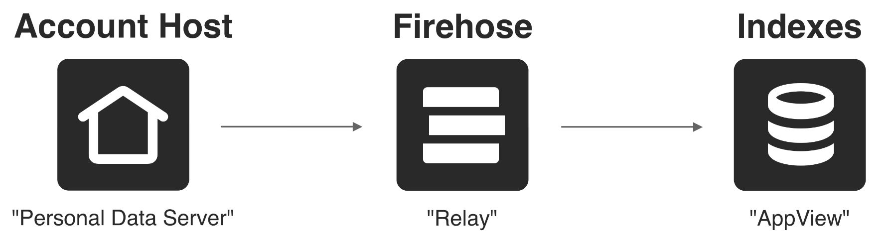
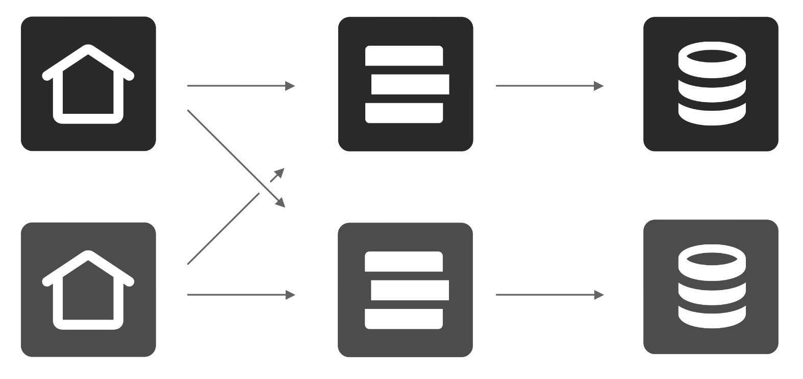
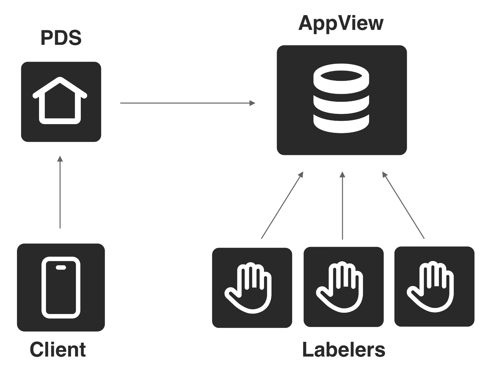
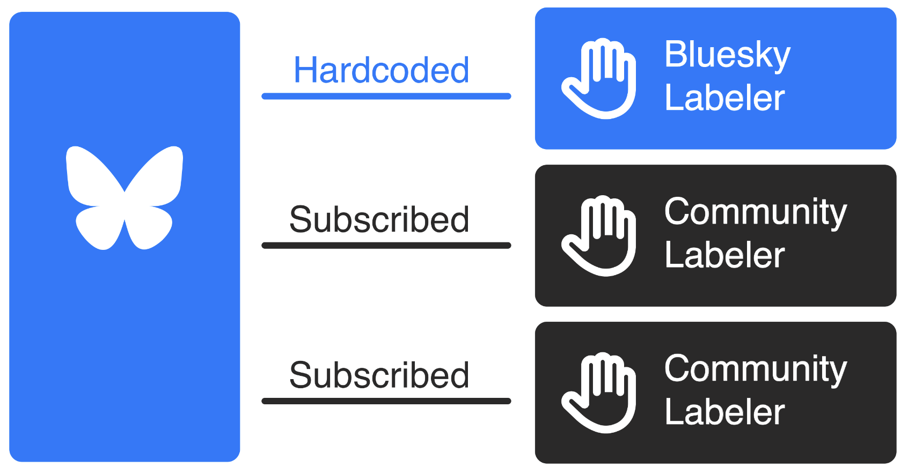
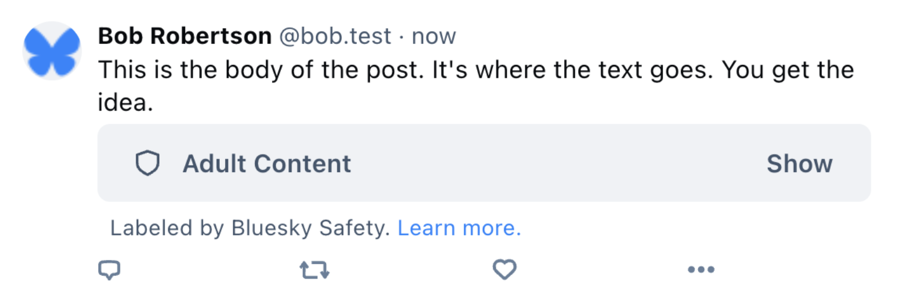
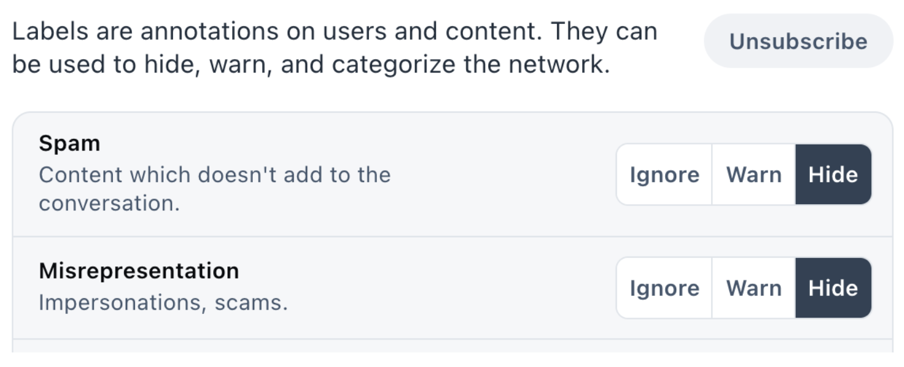
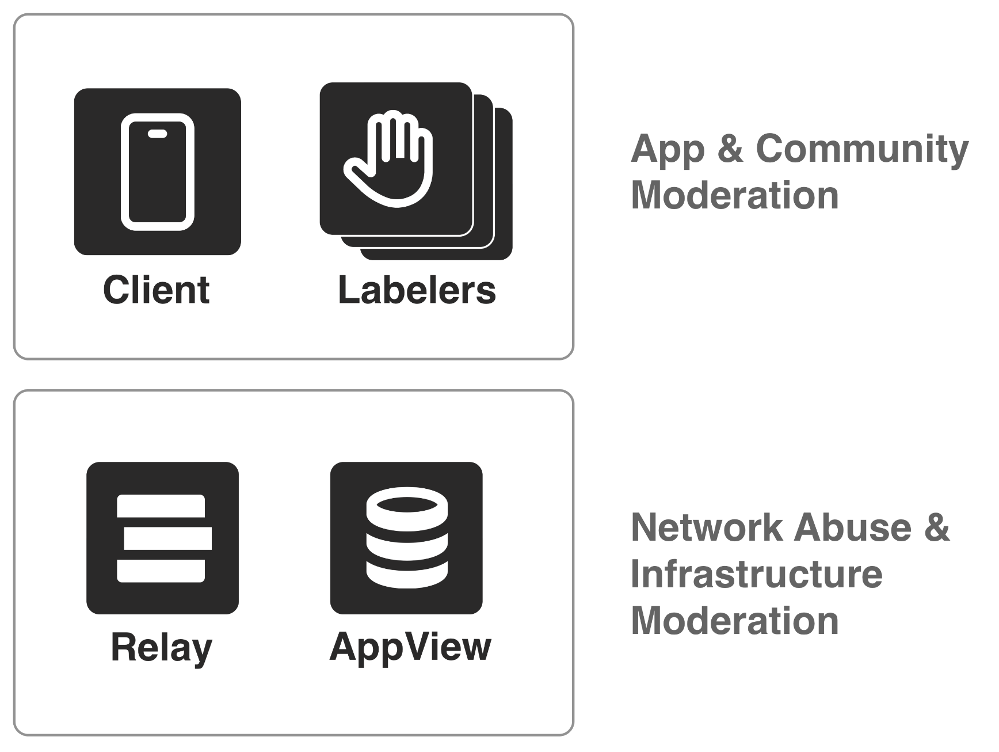

Moderation is a crucial aspect of any social network. However, traditional moderation systems often lack transparency and user control, leaving communities vulnerable to sudden policy changes and potential mismanagement. To build a better social media ecosystem, it is necessary to try new approaches. 

Today, we’re releasing an open labeling system on Bluesky. “Labeling” is a key part of moderation; it is a system for marking content that may need to be hidden, blurred, taken down, or annotated in applications. Labeling is how a lot of centralized moderation works under the hood, but nobody has ever opened it up for anyone to contribute. By building an open source labeling system, our goal is to empower developers, organizations, and users to actively participate in shaping the future of moderation.

In this post, we’ll dive into the details on how labeling and moderation works in the AT Protocol.


## An open network of microservices

The AT Protocol is an open network of services that anyone can provide, essentially opening up the backend architecture of a large-scale social network. The core services form a pipeline where data flows from where it’s hosted, through a data firehose, and out to the various application indexes.



_Data flows from independent account hosts into a firehose and then to applications._

This event-driven architecture is similar to other high-scale systems, where you might traditionally use tools like Kafka for your data firehose. However, our open system allows anyone to run a piece of the backend. This means that there can be many hosts, firehoses, and indexes, all operated by different entities and exchanging data with each other. 





_Account hosts will sync with many firehoses._

Why would you want to run one of these services?


* You’d run a **PDS** (Personal Data Server) if you want to self-host your data and keys to get increased control and privacy.
* You’d run a **Relay** if you want a full copy of the network, or to crawl subsets of the network for targeted applications or services.
* You’d run an **AppView** if you want to build custom applications with tailored views and experiences, such as a custom view for microblogging or for photos.

So what if you want to run your own moderation?


## Decentralized moderation

On traditional social media platforms, moderation is often tightly coupled with other aspects of the system, such as hosting, algorithms, and the user interface. This tight coupling reduces the resilience of social networks as businesses change ownership or as policies shift due to financial or political pressures, leaving users with little choice but to accept the changes or stop using the service.

Decentralized moderation provides a safeguard against these risks. It relies on three principles:


1. **Separation of roles**. Moderation services operate separately from other services – particularly hosting and identity – to limit the potential for overreach. 
2. **Distributed operation.** Multiple organizations providing moderation services reduces the risk of a single entity failing to serve user interests.
3. **Interoperation.** Users can choose between their preferred clients and associated moderation services without losing access to their communities.

In the AT Protocol, the PDS stores and manages user data, but it isn’t designed to handle moderation directly. A PDS could remove or filter content, but we chose not to rely on this for two main reasons. First, users can easily switch between PDS providers thanks to the account-migration feature. This means any takedowns performed by a PDS might only have a short-term effect, as users could move their data to another provider. Second, data hosting services aren't always the best equipped to deal with the challenges of content moderation, and those with local expertise and community building skills who want to participate in moderation may lack the technical capacity to run a server. 

This is different from ActivityPub servers (Mastodon), which manage both data hosting and moderation as a bundled service, and do not make it as easy to switch servers as the AT Protocol does. By separating data storage from moderation, we let each service focus on what it does best.


## Where moderation is applied

Moderation is done by a dedicated service called the **Labeler** (or “Labeling service”).

Labelers produce “labels” which are associated with specific pieces of user-generated content, such as individual posts,  accounts, lists, or feeds. These labels make an assertion about the content, such as whether it contains sensitive material, is unpleasant, or is misleading.

These labels get synced to the AppViews where they can be attached to responses at the client’s request.





_Labels are synced into AppViews where they can be attached to responses._

The clients read those labels to decide what to hide, blur, or drop. Since the clients choose their labelers and how to interpret the labels, they can decide which moderation systems to support. The chosen labels do not have to be broadcast, except to the AppView and PDS which fulfill the requests. A user subscribing  to a labeler is not public, though the PDS and AppView can privately infer which users are subscribed to which services. 

In the Bluesky app, we hardcode our in-house moderation to provide a strong foundation that upholds our community guidelines. We will continue to uphold our existing policies in the Bluesky app, even as this new architecture is made available. With the introduction of labelers, users will be able to subscribe to additional moderation services on top of the existing foundation of our in-house moderation.





_The Bluesky application hardcodes its labeling and then stacks community labelers on top._

For the best user experience, we suggest that clients in the AT Protocol ecosystem follow this pattern: have at least one built-in moderation service, and allow additional user-chosen mod services to be layered in on top.

The Bluesky app is a space that we create and maintain, and we want to provide a positive environment for our users, so our moderation service is built-in. On top of that, the additional services that users can subscribe to creates a lot of options within the app. However, if users disagree with Bluesky’s application-level moderation, they can choose to use another client on the network with its own moderation system. There are additional nuances to infrastructure-level moderation, which we will discuss below, but most content moderation happens at the application level.


## How are labels defined?

A limited core set of labels are defined at the protocol level. These labels handle generic cases (“Content Warning”) and common adult content cases (“Pornography,” “Violence”).





_A label can cover the content of a post with a warning._

Labelers may additionally define their own custom labels. These definitions are relatively straightforward; they give the label a localized name and description, and define the effects they can have.

```typescript
interface LabelDefinition {
  identifier: string
  severity: 'inform' | 'alert'
  blurs: 'content' | 'media' | 'none'
  defaultSetting: 'hide' | 'warn' | 'ignore'
  adultContent: boolean
  locales: Record<string, LabelStrings>
}

interface LabelStrings {
  name: string
  description: string  
}
```

Using these definitions, it’s possible to create labels which are informational (“Satire”), topical (“Politics”), curational (“Dislike”), or moderational (“Rude”).

Users can then tune how the application handles these labels to get the outcomes they want.





_Users configure whether they want to use each label._

Learn more about label definitions in the [API Docs on Labelers and Moderation](https://docs.bsky.app/docs/advanced-guides/moderation).


## Running a labeler

We recently open-sourced Ozone, our powerful open-source Labeler service that we use in-house to moderate Bluesky. This is a significant step forward in transparency and community involvement, as we're sharing the same professional-grade tooling that our own moderation team relies on daily.

Ozone is designed for traditional moderation, where a team of moderators receives reports and takes action on them, but you're free to apply other models with custom software. We recommend anyone interested in running a labeler try out Ozone, as it simplifies the process by helping labelers set up their service account, field reports, and publish labels from the same web interface used by Bluesky's own moderation team, ensuring that all the necessary technical requirements are met. Detailed instructions for setting up and operating Ozone can be found in the readme.

Beyond Ozone’s interface, you can also explore alternative ways of labeling content. A few examples we've considered:


* Community-driven voting systems (great for curation)
* Network analysis (e.g., for detecting botnets)
* AI models

If you want to create your own labeler, you simply need to build a web service that implements two endpoints to serve its labels to the wider network:


* com.atproto.label.subscribeLabels : a realtime subscription of all labels
* com.atproto.label.queryLabels : for looking up labels you've published on user-generated content

Reporting content is an important part of moderation, and reports should be sent privately to whoever is able to act on them. The Labeling service's API includes a specific endpoint designed for this use case. To receive user reports, a labeler can implement:


* com.atproto.report.createReport : files a report from a particular user

When a user submits a report, they choose which of their active Labelers to report to. This gives users the ability to decide who should be informed of an issue. Reports serve as an additional signal for labelers, and they can handle them in a manner that best suits their needs, whether through human review or automated resolution. Appeals from users are essentially another type of report that provides feedback to Labelers. It's important to note that a Labeler is not required to accept reports.

In addition to the technical implementation, your labeler should also have a dedicated Bluesky account associated with it. This account serves as your labeler's public presence within the Bluesky app, allowing you to share information about the types of labels you plan to publish and how users should interpret them. By publishing an `app.bsky.labeler.service` record, you effectively "convert" your account into a Bluesky labeler, enabling users to discover and subscribe to your labeling service.

More details about labels and labelers can be found in the [atproto specs](https://atproto.com/specs/label).


## Infrastructure moderation

Labeling is the basic building block of composable moderation, but there are other aspects involved. In the AT Protocol network, various services, such as the PDS, Relay, and AppView, have ultimate discretion over what content they carry, though it's not the most straightforward avenue for content moderation. Services that are closer to users, such as the client and labelers, are designed to be more actively involved in community and content moderation. These service providers have a better understanding of the specific community norms and social dynamics within their user base. By handling content moderation at this level, clients and labelers can make more informed decisions that align with the expectations and values of their communities.

Infrastructure providers such as Relays play a different role in the network, and are designed to be a common service provider that serves many kinds of applications. Relays perform simple data aggregation, and as the network grows, may eventually come to serve a wide range of social apps, each with their own unique communities and social norms. Consequently, Relays focus on combating network abuse and mitigating infrastructure-level harms, rather than making granular content moderation decisions.

An example of harm handled at the infrastructure layer is content that is illegal to host, such as child sexual abuse material (CSAM). Service providers should actively detect and remove content that cannot be hosted in the jurisdictions in which they operate. Bluesky already [actively monitors](https://bsky.social/about/blog/01-16-2024-moderation-2023) its infrastructure for illegal content, and we're working on systems to advise other services (like PDS hosts) about issues we find.





_Labels drive moderation in the client. The Relay and Appview apply infrastructure moderation._

This separation between backend infrastructure and application concerns is similar to how the web itself works. The PDSs function like personal websites or blogs on the web, which are hosted by various hosting providers. Just as individuals can choose their hosting provider and move their website if needed, users on the AT Protocol can select their PDS and migrate their data if they wish to change providers. Multiple companies can then run Relays and AppViews over PDSs, which are similar to content delivery networks and search engines, that serve as the backbone infrastructure to aggregate and index information. To provide a unified experience to the end user, application and labeling systems then provide a robust, opinionated approach to content moderation, the way individual websites and applications set their own community guidelines.


## In summary

Bluesky's open labeling system is a significant step towards a more transparent, user-controlled, and resilient way to do moderation. We’ve opened up the way centralized moderation works under the hood for anyone to contribute, and provided a seamless integration into the Bluesky app for independent moderators. In addition, by open sourcing our internal moderation tools, we're allowing anyone to use, run, and contribute to improving them.  

This open labeling system is a fundamentally new approach that has never been tried in the realm of social media moderation. In an industry where innovation has been stagnant for far too long, we are experimenting with new solutions to address the complex challenges faced by online communities. Exploring new approaches is essential if we want to make meaningful progress in tackling the problems that plague social platforms today, and we have designed and implemented what we believe to be a powerful and flexible approach.

Our goal has always been to build towards a more transparent and resilient social media ecosystem that can better represent an open society. We encourage developers, users, and organizations to get involved in shaping the future of moderation on Bluesky by running their own labeling services, contributing to the open-source Ozone project, or providing feedback on this system of stackable moderation. Together, we can design a more user-controlled social media ecosystem that empowers individuals and communities to create better online spaces.

Additional reading:


* [API Docs on Labelers and Moderation](https://docs.bsky.app/docs/advanced-guides/moderation)
* [Labels specification](https://atproto.com/specs/label)
* [Blogpost: Bluesky’s Stackable Approach to Moderation](https://bsky.social/about/blog/03-12-2024-stackable-moderation)